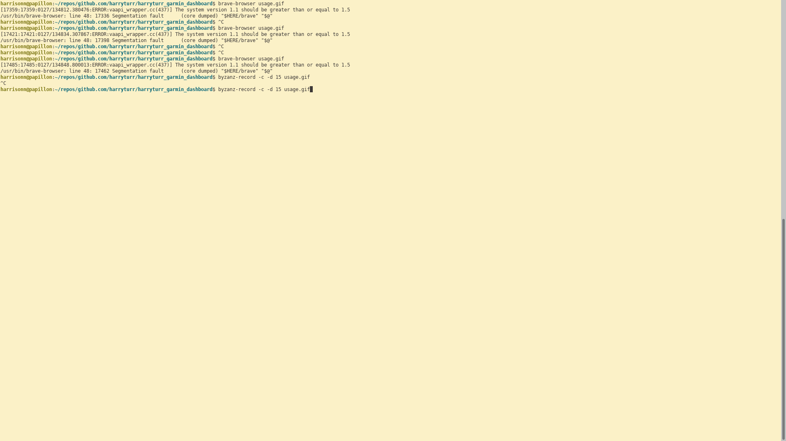
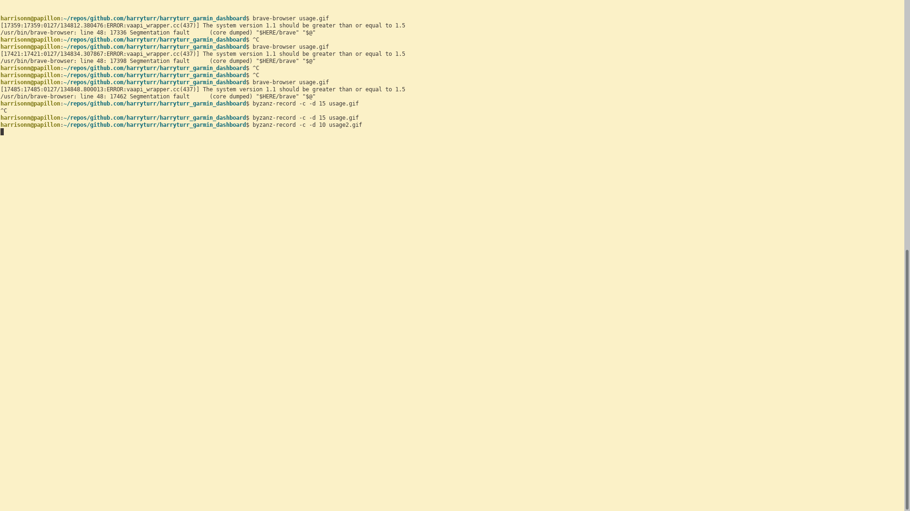

# HARRYTURR

Harryturr is a Plot.ly Dash app designed to view and analyze .gpx data from Garmin Connect and Strava .gpx files.

## Installation

Use the package manager [pip](https://pip.pypa.io/en/stable/) to install virtualenv:

```bash
python3 -m pip install --user virtualenv
```
Then, you can activate your virtual environment:
```bash
source env/bin/activate
```

## Usage
You can see the live web app with my activities for the past year [here](https://www.harryturr.no/). 

Each unique activity is one .gpx file, which is imported and plotted on the main scatter plot.



* The **range slider** is used to adjust the months of the activities we want to look at.

* The **three buttons** can be used to quickly jump between all time, the past three months, and the past one month. 

* The **radio buttons** are used to determine what y-axis we will use for visualizing this scatter plot, eg distance, calories, max heart rate.

* The **checkboxes** are used to filter between which activities we want to have displayed.

Clicking on an activity in the top scatter plot will then generate a more detailed report in the bottom.



* The **elevation trace** shows the elevation versus time of the selected activity.


* The **gps coordinates** shows the lattitude and longitude of the activity. In the future, this will be plotted on a topography leaflet map.

* The **stats** container showed detailed metrics from the selected activity.


For your personal use, you can download your activity .gpx data. It is easiest to export them from [Strava](https://support.strava.com/hc/en-us/articles/216918437-Exporting-your-Data-and-Bulk-Export), since chances are it is already synced there. However, if you use just Garmin Connect, [it is also possible](http://wanderingstar.github.io/2018/01/21/13-08-bulk-download-garmin-connect-gpx.html).

For speed of running the Plot.ly dashboard at run time, it is best to convert the .gpx data into a .csv. Our app can then quickly load the .csvs into Pandas dataframes for quick real time plotting. In order to do this, you can use gpx_to_csv.py, choosing your input and output directories in the file.

The triple button for month selection is rendered from a React JS component into Plot.ly Dash component using the [dash-component-boilerplate](https://github.com/plotly/dash-component-boilerplate). The source code for this component is in the react_buttons directory, and can be rebuilt if you modify it following the Plot.ly documentation and the README in that directory.


## Contributing
Pull requests are welcome. For major changes, please open an issue first to discuss what you would like to change.

## License
[MIT](https://choosealicense.com/licenses/mit/)